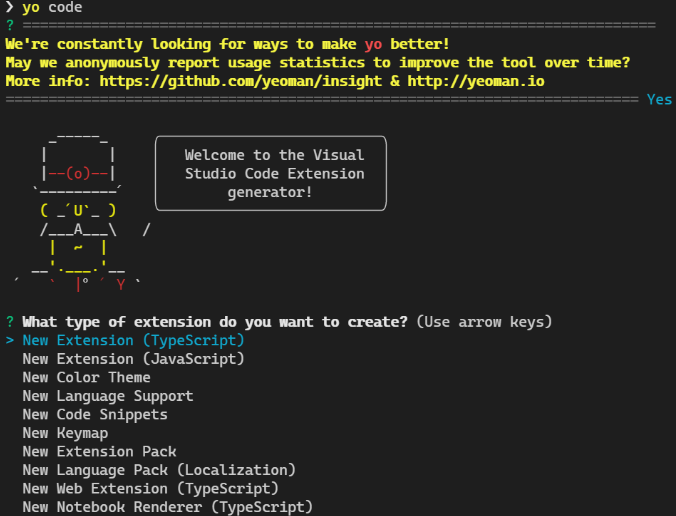
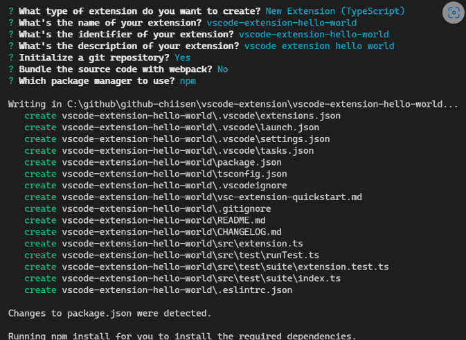
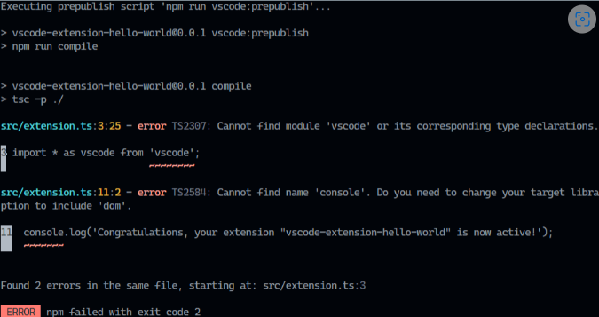
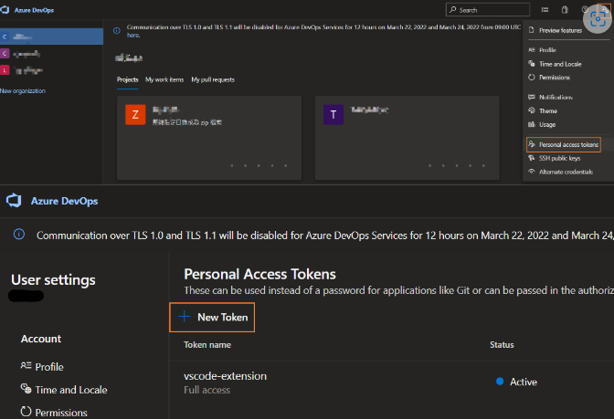
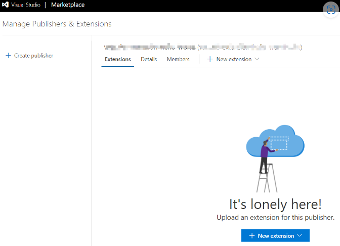
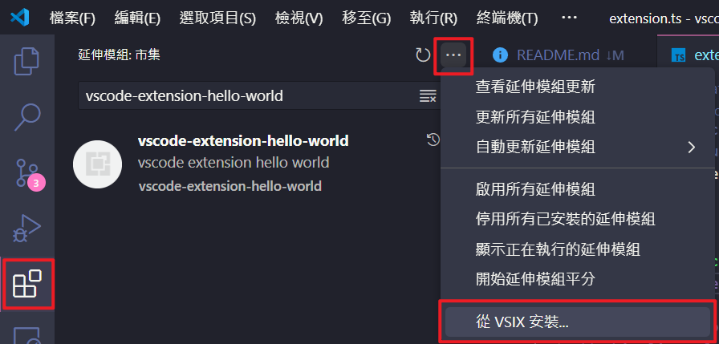

# vscode-extension-hello-world

VSCode Extension 測試程式

---

# 安裝 yo 範本產生器

```bash=
npm install -g yo generator-code
```

yo 範本產生器:
```bash=
yo code
```





# 編譯 .vsix
安裝 vsce(編譯.vsix檔案):
```bash=
npm i vsce -g
```

編譯成.vsix安裝檔案:
```bash=
vsce package
```
`README.md` 記得要修改唷，不然編譯不過

# 解決 vsce 編譯錯誤

😁解決方法: "skipLibCheck": true => tsconfig.json
* 記得先執行 ==npm ci==

# 上傳 .vsix
https://aka.ms/SignupAzureDevOps



建立上傳的驗證 token
- 點選【New Token】
```bash=
vsce publish
```

```bash=
ERROR  The 'create-publisher' command is no longer available. You can create a publisher directly in the Marketplace: https://aka.ms/vscode-create-publisher
```
* 記得要填 repository

直接下面網頁 https://aka.ms/vscode-create-publisher 上傳檔案
==發佈成功==



Details 裡面有 publisher id: vscode-extension-hello-world-1221

# VSCode 安裝 VSCode Extension (*.vsix)

1. 點擊左下角的擴展圖示（Extensions）圖示，或使用快捷鍵 Ctrl+Shift+X。
2. 在擴展側邊欄中，點擊右上角的三個點（More Actions）圖示，然後選擇「Install from VSIX...」。
3. 瀏覽到您存儲的 .vsix 檔案所在位置，選擇該檔案，然後點擊「安裝」。
4. 安裝完成後，您的新擴展就會出現在您的擴展清單中。

