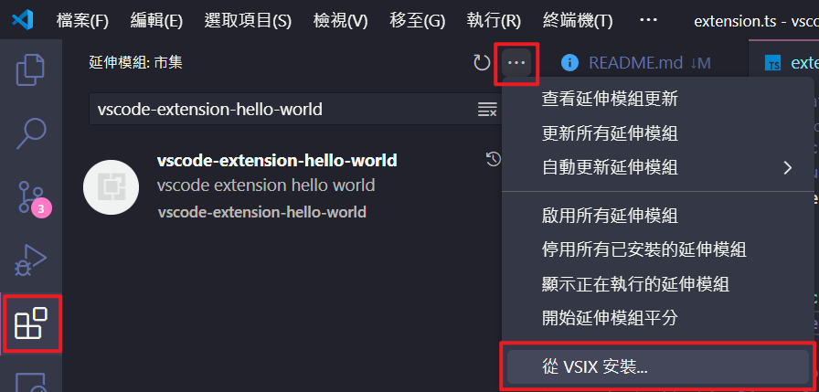

# VSCode 安裝 VSCode Extension (*.vsix)

1. 點擊左下角的擴展圖示（Extensions）圖示，或使用快捷鍵 Ctrl+Shift+X。
2. 在擴展側邊欄中，點擊右上角的三個點（More Actions）圖示，然後選擇「Install from VSIX...」。
3. 瀏覽到您存儲的 .vsix 檔案所在位置，選擇該檔案，然後點擊「安裝」。
4. 安裝完成後，您的新擴展就會出現在您的擴展清單中。